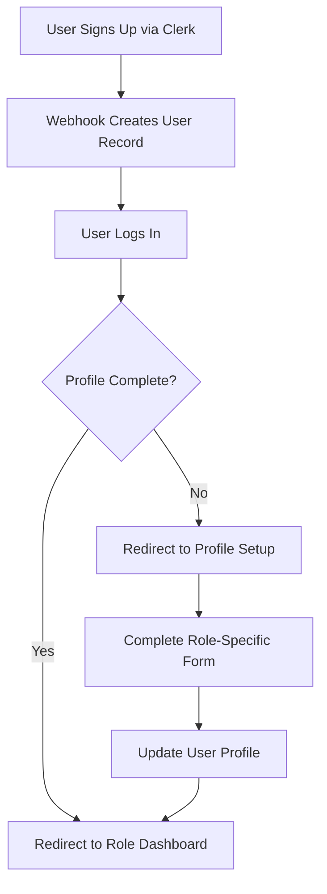
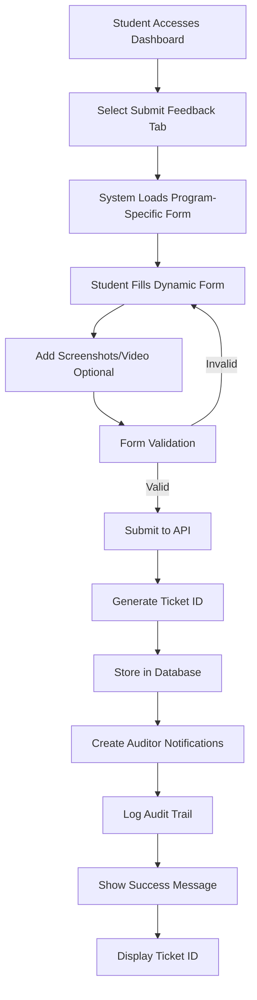
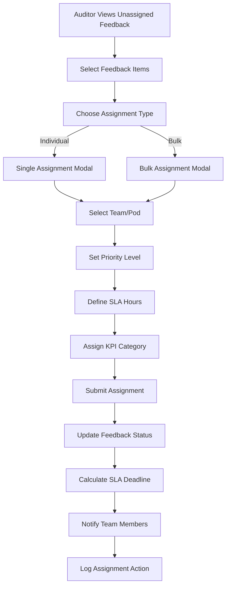
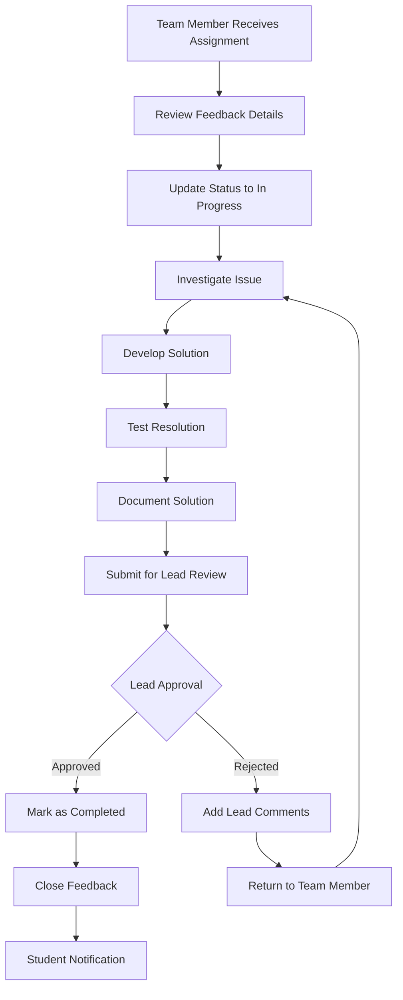
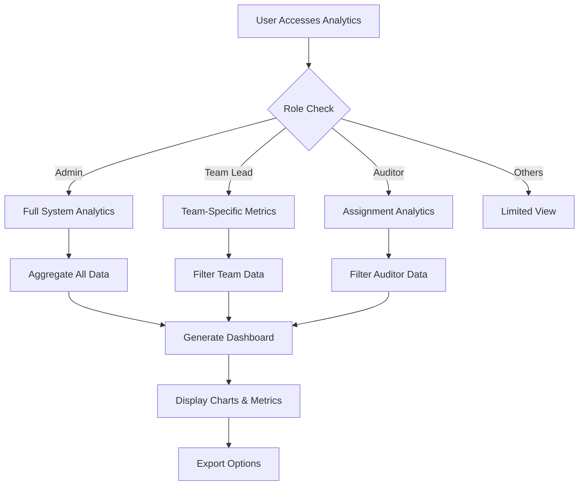

# Feedback Management System - Comprehensive Documentation

## Table of Contents

1. [Application Overview](#application-overview)
2. [Architecture & Technology Stack](#architecture--technology-stack)
3. [Authentication & Authorization](#authentication--authorization)
4. [User Roles & Permissions](#user-roles--permissions)
5. [API Endpoints](#api-endpoints)
6. [Database Models](#database-models)
7. [Application Flow](#application-flow)
8. [Components Architecture](#components-architecture)
9. [Hooks & Utilities](#hooks--utilities)
10. [Best Practices](#best-practices)
11. [Security Considerations](#security-considerations)
12. [Potential Improvements](#potential-improvements)

---

## Application Overview

### Purpose

This is an enterprise-grade feedback management system designed for educational institutions. It enables students to submit feedback about courses, tracks the resolution process through teams, and provides comprehensive analytics and auditing capabilities.

### Key Features

- **Multi-Program Support**: NIAT, Intensive, and Academy programs
- **Role-Based Access Control**: 6 different user roles with specific permissions
- **Dynamic Form System**: Customizable feedback forms per program
- **Kanban-Style Workflow**: Visual tracking of feedback resolution
- **Real-time Notifications**: System-wide notification management
- **Comprehensive Auditing**: Complete activity logging
- **SLA Management**: Service level agreement tracking
- **Analytics Dashboard**: Performance metrics and insights

---

## Architecture & Technology Stack

### Frontend

- **Framework**: Next.js 15 with React 19
- **Styling**: Tailwind CSS 4.1 with custom component library
- **UI Components**: Radix UI primitives with custom theming
- **State Management**: React hooks and local state
- **Forms**: React Hook Form with Zod validation
- **Icons**: Lucide React
- **Fonts**: Geist Sans & Mono

### Backend

- **Runtime**: Next.js API Routes (Edge Runtime)
- **Database**: MongoDB with Mongoose ODM
- **Authentication**: Clerk (OAuth provider)
- **File Storage**: Simulated (can be replaced with UploadThing/S3)
- **Webhooks**: Svix for webhook verification

### Development Tools

- **Language**: TypeScript
- **Build Tool**: Next.js built-in bundler
- **Package Manager**: pnpm
- **CSS Framework**: Tailwind CSS with PostCSS

---

## Authentication & Authorization

### Authentication Provider: Clerk

#### Setup Configuration

```typescript
// Environment Variables Required:
NEXT_PUBLIC_CLERK_PUBLISHABLE_KEY=pk_test_...
CLERK_SECRET_KEY=sk_test_...
MONGODB_URI=mongodb://...
```

#### Middleware Protection

```typescript
// middleware.ts
const isPublicRoute = createRouteMatcher(["/sign-in(.*)", "/sign-up(.*)"]);

export default clerkMiddleware(async (auth, req) => {
  if (!isPublicRoute(req)) {
    await auth.protect(); // Protects all routes except sign-in/sign-up
  }
});
```

#### Authentication Flow

1. **User Registration**: Clerk handles OAuth/email registration
2. **Webhook Integration**: Clerk webhooks sync user data to MongoDB
3. **Profile Setup**: First-time users complete role-based profile
4. **Session Management**: Clerk manages JWT tokens and sessions
5. **Route Protection**: Middleware validates authentication on all protected routes

#### User Synchronization

```typescript
// Webhook endpoint: /api/webhooks/clerk/route.ts
// Syncs user creation and updates from Clerk to MongoDB
if (eventType === "user.created") {
  await DatabaseService.createUser({
    clerkId: id,
    email: email_addresses[0]?.email_address,
    name: `${first_name} ${last_name}`.trim(),
    role: "student", // Default role
  });
}
```

---

## User Roles & Permissions

### Role Hierarchy & Capabilities

#### 1. **Student**

- **Primary Function**: Submit and track feedback
- **Permissions**:
  - Submit new feedback via dynamic forms
  - View own feedback history
  - Track feedback status and resolution
  - Update own profile information
- **Dashboard**: Student-specific interface with submission form and history
- **Restrictions**: Cannot view other users' feedback or admin functions

#### 2. **Auditor**

- **Primary Function**: Review and assign feedback to teams
- **Permissions**:
  - View all submitted feedback
  - Assign feedback to teams and set priority
  - Set SLA deadlines and KPI categories
  - Generate AI-powered suggestions for resolution
  - Monitor overall system metrics
- **Dashboard**: Auditor interface with assignment capabilities
- **Special Features**: Feedback assignment modal, priority setting

#### 3. **Team Member**

- **Primary Function**: Resolve assigned feedback
- **Permissions**:
  - View feedback assigned to their team/pod
  - Update feedback status (pending → in_progress → resolved)
  - Add resolution text and preventive measures
  - Comment on feedback items
  - View team-specific metrics
- **Dashboard**: Team-member interface with Kanban board
- **Workflow**: Receive assignments → Work on resolution → Submit for approval

#### 4. **Team Lead**

- **Primary Function**: Manage team workflow and approve resolutions
- **Permissions**:
  - All team member permissions
  - Assign feedback to specific team members
  - Approve or reject resolution submissions
  - Provide feedback comments and guidance
  - Manage team member workload
  - Access team performance analytics
- **Dashboard**: Team-lead interface with assignment controls
- **Special Authority**: Final approval on resolutions before completion

#### 5. **Admin**

- **Primary Function**: System administration and configuration
- **Permissions**:
  - Complete user management (create, update, delete, role changes)
  - Form template creation and management
  - System-wide analytics and reporting
  - Broadcast notifications to all users
  - Access complete audit trail
  - Team and pod structure management
  - System configuration and settings
- **Dashboard**: Comprehensive admin control panel
- **Full Access**: All system functions and data

#### 6. **Co-Admin**

- **Primary Function**: Assist primary admin with elevated privileges
- **Permissions**: Same as Admin with potential restrictions on critical operations
- **Use Case**: Large organizations requiring multiple administrative users

### Permission Matrix

| Feature            | Student | Auditor | Team Member | Team Lead | Admin | Co-Admin |
| ------------------ | ------- | ------- | ----------- | --------- | ----- | -------- |
| Submit Feedback    | ✅      | ❌      | ❌          | ❌        | ❌    | ❌       |
| View Own Feedback  | ✅      | ❌      | ❌          | ❌        | ✅    | ✅       |
| View All Feedback  | ❌      | ✅      | Team Only   | Team Only | ✅    | ✅       |
| Assign to Teams    | ❌      | ✅      | ❌          | ❌        | ✅    | ✅       |
| Assign to Members  | ❌      | ❌      | ❌          | ✅        | ✅    | ✅       |
| Update Status      | ❌      | ❌      | ✅          | ✅        | ✅    | ✅       |
| Approve Resolution | ❌      | ❌      | ❌          | ✅        | ✅    | ✅       |
| User Management    | ❌      | ❌      | ❌          | ❌        | ✅    | ✅       |
| Form Management    | ❌      | ❌      | ❌          | ❌        | ✅    | ✅       |
| System Analytics   | ❌      | Limited | Team Only   | Team Only | ✅    | ✅       |
| Audit Trail        | ❌      | ❌      | ❌          | ❌        | ✅    | ✅       |

---

## API Endpoints

### Authentication Endpoints

#### **GET /api/users/profile**

- **Purpose**: Retrieve current user's profile
- **Authentication**: Required (Clerk JWT)
- **Response**: User object with role and program information
- **Usage**: Profile display, role-based routing

#### **PUT /api/users/profile**

- **Purpose**: Update user profile information
- **Authentication**: Required (Clerk JWT)
- **Body**: Partial user object (excluding sensitive fields)
- **Features**: Creates user if not exists, logs audit trail
- **Validation**: Role-specific field validation

#### **POST /api/webhooks/clerk**

- **Purpose**: Sync Clerk user events to MongoDB
- **Authentication**: Webhook signature verification (Svix)
- **Events**: user.created, user.updated
- **Security**: WEBHOOK_SECRET validation required

### Feedback Management Endpoints

#### **POST /api/feedback**

- **Purpose**: Submit new feedback (Students only)
- **Authentication**: Required + Role validation (student)
- **Body**: Dynamic form data based on program type
- **Features**:
  - Auto-generates unique ticket ID
  - Sets default priority and status
  - Creates notifications for auditors
  - Logs audit trail
- **File Handling**: Simulated file upload URLs

#### **GET /api/feedback**

- **Purpose**: Retrieve feedback based on user role
- **Authentication**: Required
- **Role-based Filtering**:
  - Students: Own feedback only
  - Others: All feedback (with role-specific views)
- **Response**: Array of feedback objects

#### **PUT /api/feedback/update-status**

- **Purpose**: Update feedback status (Team members/leads)
- **Authentication**: Required + Role validation
- **Body**: { ticketId, status, resolutionText?, memberComments? }
- **Workflow**: pending → in_progress → resolved → completed
- **Audit**: Logs all status changes

#### **POST /api/feedback/assign**

- **Purpose**: Assign feedback to teams (Auditors)
- **Authentication**: Required + Role validation (auditor)
- **Body**: { ticketId, teamId, priority, slaHours, kpiCategory }
- **Features**: Sets SLA deadline, notifications to team

#### **POST /api/feedback/assign-member**

- **Purpose**: Assign feedback to specific team member (Team leads)
- **Authentication**: Required + Role validation (team_lead)
- **Body**: { ticketId, memberId, targetDate }
- **Features**: Updates assignment, creates notifications

#### **POST /api/feedback/approve-resolution**

- **Purpose**: Approve/reject resolution (Team leads)
- **Authentication**: Required + Role validation (team_lead)
- **Body**: { ticketId, approved, leadComments }
- **Workflow**: Completes feedback lifecycle

#### **POST /api/feedback/bulk-assign**

- **Purpose**: Assign multiple feedback items at once (Auditors)
- **Authentication**: Required + Role validation (auditor)
- **Body**: { feedbackIds[], teamId, priority }
- **Efficiency**: Batch operations for high-volume assignments

#### **POST /api/feedback/ai-suggestions**

- **Purpose**: Generate AI-powered resolution suggestions
- **Authentication**: Required + Role validation (auditor, team_lead)
- **Body**: { ticketId }
- **Features**: AI analysis of issue description for solution suggestions

### Form Template Management

#### **GET /api/form-templates**

- **Purpose**: Retrieve all form templates (Admin only)
- **Authentication**: Required + Role validation (admin)
- **Response**: Array of form template objects

#### **POST /api/form-templates**

- **Purpose**: Create new form template (Admin only)
- **Authentication**: Required + Role validation (admin)
- **Body**: FormTemplate object with fields array
- **Features**: Versioning, audit logging

#### **GET /api/form-templates/program/{program}**

- **Purpose**: Get active form template for specific program
- **Authentication**: Required
- **Parameters**: program (NIAT, Intensive, Academy)
- **Usage**: Dynamic form generation for students

#### **PUT /api/form-templates/{id}**

- **Purpose**: Update existing form template (Admin only)
- **Authentication**: Required + Role validation (admin)
- **Body**: Partial FormTemplate object
- **Features**: Version increment, audit trail

#### **DELETE /api/form-templates/{id}**

- **Purpose**: Delete form template (Admin only)
- **Authentication**: Required + Role validation (admin)
- **Safety**: Validates no active dependencies

### Team Management

#### **GET /api/teams**

- **Purpose**: Retrieve all teams and their structure
- **Authentication**: Required
- **Response**: Teams with members and pods
- **Usage**: Assignment dropdowns, team dashboards

#### **POST /api/teams**

- **Purpose**: Create new team (Admin only)
- **Authentication**: Required + Role validation (admin)
- **Body**: { name, leadId, memberIds[], podIds[] }

#### **GET /api/teams/{id}/pods**

- **Purpose**: Get pods within specific team
- **Authentication**: Required
- **Response**: Pod objects with members
- **Usage**: Granular assignment capabilities

### Administrative Endpoints

#### **GET /api/admin/users**

- **Purpose**: Retrieve all users for management (Admin only)
- **Authentication**: Required + Role validation (admin)
- **Features**: Pagination, filtering, role-based queries
- **Response**: Users with role and activity information

#### **PUT /api/admin/users**

- **Purpose**: Bulk user management operations (Admin only)
- **Authentication**: Required + Role validation (admin)
- **Operations**: Role changes, team assignments, status updates

#### **GET /api/admin/audit-logs**

- **Purpose**: Retrieve system audit trail (Admin only)
- **Authentication**: Required + Role validation (admin)
- **Features**: Date filtering, user filtering, action filtering
- **Response**: Comprehensive activity logs

#### **POST /api/admin/notifications/broadcast**

- **Purpose**: Send system-wide notifications (Admin only)
- **Authentication**: Required + Role validation (admin)
- **Body**: { title, message, priority, targetRoles[] }
- **Features**: Role-based targeting, priority levels

### Analytics Endpoints

#### **GET /api/analytics/overview**

- **Purpose**: Retrieve dashboard analytics
- **Authentication**: Required + Role-based data filtering
- **Features**: KPI metrics, trend analysis, SLA compliance
- **Response**: Aggregated statistics and charts data

#### **GET /api/analytics/export**

- **Purpose**: Export analytics data
- **Authentication**: Required + Role validation
- **Formats**: CSV, JSON, PDF reports
- **Features**: Date ranges, filtered exports

---

## Database Models

### User Model

```typescript
interface User {
  _id?: string;
  clerkId: string; // Primary link to Clerk authentication
  email: string;
  name: string;
  role:
    | "student"
    | "auditor"
    | "team_lead"
    | "team_member"
    | "admin"
    | "co_admin";

  // Student-specific fields
  program?: "NIAT" | "Intensive" | "Academy";
  admissionYear?: number; // NIAT specific
  university?: string; // NIAT specific
  studentId?: string;
  contactNumber?: string;

  // Team assignment
  teamId?: string; // ObjectId reference to Team
  podId?: string; // ObjectId reference to Pod

  createdAt: Date;
  updatedAt: Date;
}
```

### Feedback Model

```typescript
interface Feedback {
  _id?: string;
  ticketId: string; // Auto-generated unique identifier
  studentId: string; // Clerk user ID
  program: "NIAT" | "Intensive" | "Academy";

  // Student information
  studentName: string;
  email: string;
  contactNumber: string;

  // Feedback content
  course: string;
  unit: string;
  topic: string;
  unitDiscussionLink?: string;
  unitType: string;
  issueDescription: string;
  questionLink?: string;
  suggestedSolution?: string;

  // Program-specific fields
  admissionYear?: number; // NIAT
  university?: string; // NIAT
  studentEmployeeId?: string; // NIAT
  reportedBy?: string; // NIAT
  trackType?: "Smart" | "Genius"; // Academy

  // File attachments
  screenshots: string[]; // File URLs
  video?: string; // Video URL

  // Workflow management
  status:
    | "submitted"
    | "assigned"
    | "pending"
    | "in_progress"
    | "resolved"
    | "no_issue_found"
    | "completed";
  priority: "low" | "medium" | "high" | "critical";
  kpiCategory?: string; // Auditor-defined category
  slaHours?: number; // Service level agreement

  // Assignment tracking
  assignedTeamId?: string; // ObjectId to Team
  assignedPodId?: string; // ObjectId to Pod
  assignedMemberId?: string; // ObjectId to User
  auditorId?: string; // ObjectId to User

  // Resolution tracking
  resolutionText?: string;
  daysTaken?: number;
  actualResolutionDate?: Date;
  targetResolutionDate?: Date;
  preventiveMeasures?: string;
  memberComments?: string;
  leadApprovalStatus?: "pending" | "approved" | "rejected";
  leadComments?: string;

  // AI assistance
  aiSuggestions?: {
    proposedSolution: string;
    preventiveMeasures: string;
  };

  // Timestamps
  submittedAt: Date;
  assignedAt?: Date;
  slaDeadline?: Date;
  resolvedAt?: Date;
  completedAt?: Date;
  createdAt: Date;
  updatedAt: Date;
}
```

### Team and Pod Models

```typescript
interface Team {
  _id?: string;
  name: string;
  leadId: string; // ObjectId to User (team_lead)
  memberIds: string[]; // ObjectId array to Users
  podIds: string[]; // ObjectId array to Pods
  createdAt: Date;
  updatedAt: Date;
}

interface Pod {
  _id?: string;
  name: string;
  teamId: string; // ObjectId to Team
  leadId: string; // ObjectId to User (can be team_lead or senior team_member)
  memberIds: string[]; // ObjectId array to Users
  createdAt: Date;
  updatedAt: Date;
}
```

### Form Template Model

```typescript
interface FormField {
  _id?: string;
  name: string; // Field identifier
  label: string; // Display label
  type: "text" | "email" | "number" | "select" | "textarea" | "file" | "date";
  required: boolean;
  options?: string[]; // For select fields
  placeholder?: string;
  validation?: {
    min?: number; // Min length/value
    max?: number; // Max length/value
    pattern?: string; // Regex pattern
  };
  order: number; // Display order
}

interface FormTemplate {
  _id?: string;
  programType: string; // Program identifier
  name: string;
  description: string;
  fields: FormField[]; // Ordered form fields
  isActive: boolean; // Template status
  version: number; // Version tracking
  createdBy: string; // Admin user ID
  createdAt: Date;
  updatedAt: Date;
}
```

### Audit and Notification Models

```typescript
interface AuditLog {
  _id?: string;
  userId: string; // User who performed action
  userRole: string; // User's role at time of action
  action: string; // Action performed
  entityType: "feedback" | "user" | "team" | "pod" | "form_template";
  entityId: string; // ID of affected entity
  metadata?: any; // Additional action context
  changes?: Array<{
    // Field-level changes
    field: string;
    oldValue: any;
    newValue: any;
  }>;
  timestamp: Date;
}

interface Notification {
  _id?: string;
  userId: string; // Target user (or "system" for broadcast)
  type: string; // Notification type
  title: string;
  message: string;
  priority: "low" | "medium" | "high" | "critical";
  read: boolean;
  metadata?: any; // Additional notification data
  createdAt: Date;
  updatedAt: Date;
}
```

---

## Application Flow

### 1. User Onboarding Flow



**Detailed Steps:**

1. **Registration**: User creates account through Clerk (OAuth or email)
2. **Webhook Processing**: Clerk webhook creates minimal user record in MongoDB
3. **First Login**: User authenticates and middleware validates session
4. **Profile Check**: System checks if user has completed role setup
5. **Profile Setup**: If incomplete, redirect to profile setup page
6. **Role Assignment**: User selects role and completes required fields
7. **Dashboard Routing**: Redirect to appropriate role-based dashboard

### 2. Feedback Submission Flow (Student)



**Detailed Process:**

1. **Form Loading**: System fetches active form template for student's program
2. **Dynamic Rendering**: Form fields rendered based on template configuration
3. **File Handling**: Optional screenshot and video upload with validation
4. **Submission**: Form data validated and submitted to feedback API
5. **Processing**: Ticket ID generated, database updated, notifications sent
6. **Confirmation**: Student receives ticket ID and can track progress

### 3. Feedback Assignment Flow (Auditor)



**Key Features:**

- **Bulk Operations**: Assign multiple feedback items simultaneously
- **SLA Management**: Automatic deadline calculation based on hours
- **Priority Setting**: Critical, High, Medium, Low priority levels
- **KPI Categorization**: Business intelligence categorization
- **Team Notifications**: Automatic alerts to assigned team members

### 4. Resolution Workflow (Team Members & Leads)



**Status Transitions:**

- **assigned** → **pending** (Team member acknowledges)
- **pending** → **in_progress** (Work begins)
- **in_progress** → **resolved** (Solution submitted)
- **resolved** → **completed** (Lead approval)
- **resolved** → **pending** (Lead rejection)

### 5. Analytics and Reporting Flow



---

## Components Architecture

### Layout Structure

#### **RootLayout** (`app/layout.tsx`)

- **Purpose**: Global app wrapper with providers
- **Features**:
  - Clerk authentication provider
  - Dark theme configuration
  - Global CSS and font loading
  - Analytics integration (Vercel)
- **Theme**: Consistent dark theme across application

#### **DashboardHeader** (`components/dashboard-header.tsx`)

- **Purpose**: Consistent header across all dashboards
- **Props**: title, description
- **Features**: Logout button, user profile display
- **Reusability**: Used across all role-specific dashboards

### Role-Specific Dashboards

#### **Student Dashboard** (`app/dashboard/student/page.tsx`)

- **Components Used**:
  - `DynamicFeedbackForm`: Program-specific form rendering
  - `FeedbackSuccess`: Post-submission confirmation
  - `Tabs`: Submit/View toggle interface
- **State Management**:
  - Form data state
  - Feedback history state
  - Search and filter state
- **Key Features**:
  - Dynamic form loading based on program
  - Real-time feedback history
  - Search and status filtering
  - File upload handling

#### **Team Member Dashboard** (`app/dashboard/team-member/page.tsx`)

- **Components Used**:
  - `KanbanBoard`: Visual workflow management
  - Status update modals
  - Resolution form components
- **Workflow**: Kanban-style task management
- **Features**:
  - Drag-and-drop interface (potential)
  - Status progression controls
  - Resolution documentation

#### **Team Lead Dashboard** (`app/dashboard/team-lead/page.tsx`)

- **Additional Features**:
  - Member assignment controls
  - Resolution approval interface
  - Team performance metrics
- **Extended Permissions**: All team member features plus leadership tools

#### **Auditor Dashboard** (`app/dashboard/auditor/page.tsx`)

- **Components Used**:
  - `FeedbackAssignmentModal`: Team/pod assignment interface
  - Bulk assignment tools
  - Priority and SLA management
- **Key Functions**:
  - Unassigned feedback queue
  - Assignment workflow
  - KPI categorization

#### **Admin Dashboard** (`app/dashboard/admin/page.tsx`)

- **Component Structure**:
  - Tabbed interface with 6 sections
  - `UserManagementTable`: Complete user administration
  - `AuditTrail`: System activity monitoring
  - `BroadcastNotifications`: System-wide messaging
  - Form template management
- **Features**:
  - System overview metrics
  - Quick action panels
  - Recent activity feed

### Shared UI Components

#### **Form Components**

- **DynamicFeedbackForm**: Renders forms based on database templates
- **FormField Renderers**: Handles all form field types (text, select, file, etc.)
- **File Upload Components**: Screenshot and video upload with validation

#### **Data Display Components**

- **KanbanBoard**: Workflow visualization with role-based actions
- **UserManagementTable**: Sortable, filterable user administration
- **AuditTrail**: Searchable activity log with filtering
- **MetricsCards**: Dashboard statistics display

#### **UI Primitives** (components/ui/)

- **Radix UI Based**: Accessible, customizable components
- **Consistent Theming**: Dark theme with custom color palette
- **Component Library**: 30+ reusable UI components
- **Type Safety**: Full TypeScript integration

### Component Communication Patterns

#### **Parent-Child Props**

```typescript
// Example: KanbanBoard component
interface KanbanBoardProps {
  feedback: any[];
  onAssignMember?: (feedback: any) => void;
  onUpdateStatus?: (feedback: any) => void;
  onApproveResolution?: (feedback: any) => void;
  userRole: string;
}
```

#### **Event Handling**

- **Callback Functions**: Components communicate via callback props
- **State Lifting**: Shared state managed at appropriate parent level
- **Role-Based Rendering**: Components adapt UI based on user role

#### **Data Fetching Pattern**

```typescript
// Common pattern across dashboards
useEffect(() => {
  fetchUserProfile();
  fetchFeedback();
}, []);

const fetchFeedback = async () => {
  try {
    const response = await fetch("/api/feedback");
    const data = await response.json();
    setFeedback(data.feedback || []);
  } catch (error) {
    console.error("Error fetching feedback:", error);
  }
};
```

---

## Hooks & Utilities

### Custom Hooks

#### **useToast** (`hooks/use-toast.ts`)

- **Purpose**: Global notification system
- **Features**:
  - Toast notifications with variants (success, error, warning)
  - Auto-dismiss functionality
  - Queue management
  - Customizable duration and styling
- **Usage**: Error handling, success confirmations, user feedback

```typescript
const { toast } = useToast();

toast({
  title: "Success",
  description: "Feedback submitted successfully!",
  variant: "default",
});
```

#### **useMobile** (`hooks/use-mobile.ts`)

- **Purpose**: Responsive design utility
- **Functionality**: Detects mobile screen sizes
- **Usage**: Conditional rendering for mobile/desktop views

### Utility Libraries

#### **Database Service** (`lib/db-utils.ts`)

- **Pattern**: Static class with async methods
- **Features**:
  - MongoDB connection management
  - CRUD operations for all models
  - Query optimization and aggregation
  - Audit logging integration
- **Key Methods**:
  - User operations (create, update, get by Clerk ID)
  - Feedback operations (CRUD, status updates, search)
  - Team and pod management
  - Form template operations
  - Audit log creation

#### **MongoDB Connection** (`lib/mongodb.ts`)

- **Pattern**: Connection singleton with caching
- **Features**:
  - Connection pooling
  - Environment-based configuration
  - Error handling and reconnection

#### **Utility Functions** (`lib/utils.ts`)

- **cn()**: Tailwind class name utility with clsx
- **Type utilities**: Common TypeScript helpers
- **Validation helpers**: Form validation utilities

### Data Models (`lib/models/`)

#### **Model Organization**:

- **User.ts**: User, Team, and Pod schemas
- **Feedback.ts**: Feedback and FormTemplate schemas
- **AuditLog.ts**: Audit logging schema
- **Notification.ts**: Notification system schema
- **index.ts**: Centralized exports

#### **Mongoose Integration**:

- **Schema Definition**: Comprehensive field validation
- **Reference Relationships**: ObjectId references between models
- **Indexing Strategy**: Optimized queries for performance
- **Middleware**: Pre/post hooks for data consistency

---

## Best Practices

### 1. Security Best Practices

#### **Authentication & Authorization**

- **JWT Validation**: All API routes validate Clerk JWT tokens
- **Role-Based Access**: Granular permission checking per endpoint
- **Webhook Security**: Svix signature verification for Clerk webhooks
- **Environment Variables**: Sensitive data stored in environment variables
- **Input Validation**: Comprehensive request body validation

```typescript
// Example: Role-based API protection
const user = await DatabaseService.getUserByClerkId(userId);
if (!user || user.role !== "admin") {
  return NextResponse.json({ error: "Unauthorized" }, { status: 403 });
}
```

#### **Data Protection**

- **Field Sanitization**: Removing sensitive fields from API responses
- **Audit Logging**: Complete activity tracking for compliance
- **Data Validation**: Zod schemas for runtime type checking
- **File Upload Security**: File type and size validation

### 2. Performance Optimization

#### **Database Optimization**

- **Connection Pooling**: MongoDB connection reuse
- **Query Optimization**: Efficient aggregation pipelines
- **Indexing Strategy**: Strategic database indexes for common queries
- **Data Pagination**: Large dataset handling with pagination

#### **Frontend Performance**

- **Component Lazy Loading**: Dynamic imports for large components
- **Image Optimization**: Next.js built-in image optimization
- **Bundle Optimization**: Tree shaking and code splitting
- **Caching Strategy**: Browser caching for static assets

### 3. Code Organization

#### **File Structure**

- **Feature-Based Organization**: Components grouped by functionality
- **Consistent Naming**: PascalCase for components, camelCase for functions
- **Barrel Exports**: Centralized exports from directories
- **Type Definitions**: Centralized TypeScript interfaces

#### **Component Design**

- **Single Responsibility**: Each component has one clear purpose
- **Composition Pattern**: Building complex UIs from simple components
- **Props Validation**: TypeScript interfaces for all props
- **Reusability**: Shared components for common UI patterns

### 4. Error Handling

#### **API Error Handling**

```typescript
try {
  // API operation
} catch (error) {
  console.error("Detailed error context:", error);
  return NextResponse.json({ error: "User-friendly message" }, { status: 500 });
}
```

#### **Frontend Error Handling**

- **Try-Catch Blocks**: Proper error boundaries
- **User Feedback**: Toast notifications for errors
- **Graceful Degradation**: Fallback UI states
- **Loading States**: Clear loading indicators

### 5. User Experience

#### **Responsive Design**

- **Mobile-First**: Mobile-optimized layouts
- **Consistent Spacing**: Tailwind spacing system
- **Accessibility**: ARIA labels and keyboard navigation
- **Dark Theme**: Consistent dark theme across application

#### **Loading and Feedback**

- **Loading States**: Skeleton screens and spinners
- **Success Feedback**: Confirmation messages for actions
- **Progress Indicators**: Multi-step process guidance
- **Error Recovery**: Clear error messages with action steps

### 6. Development Workflow

#### **TypeScript Integration**

- **Strict Mode**: Enabled for type safety
- **Interface Definition**: Comprehensive type definitions
- **Generic Types**: Reusable type patterns
- **Type Guards**: Runtime type checking

#### **Code Quality**

- **Consistent Formatting**: Prettier configuration
- **Naming Conventions**: Clear, descriptive names
- **Comment Strategy**: JSDoc for complex functions
- **Code Reviews**: Structured review process

---

## Security Considerations

### 1. Authentication Security

#### **Clerk Integration Security**

- **JWT Verification**: Server-side token validation on every request
- **Session Management**: Secure session handling with automatic refresh
- **OAuth Security**: Secure third-party authentication flows
- **Account Security**: Multi-factor authentication support

#### **API Security**

- **Route Protection**: Middleware-based authentication for all protected routes
- **Role Validation**: Server-side role checking for sensitive operations
- **Request Validation**: Input sanitization and validation
- **Rate Limiting**: Protection against API abuse (implementation recommended)

### 2. Data Security

#### **Database Security**

- **Connection Security**: Encrypted MongoDB connections
- **Access Control**: Database-level user permissions
- **Data Encryption**: Sensitive data encryption at rest
- **Backup Security**: Secure backup procedures

#### **File Upload Security**

- **File Type Validation**: Restricted file types (images, videos only)
- **Size Limitations**: File size restrictions (20MB video limit)
- **Virus Scanning**: Recommendation for file scanning integration
- **Storage Security**: Secure file storage with access controls

### 3. Application Security

#### **Cross-Site Scripting (XSS) Prevention**

- **Input Sanitization**: All user inputs sanitized
- **Output Encoding**: Proper HTML encoding
- **Content Security Policy**: Recommended CSP headers
- **React Security**: JSX automatic escaping

#### **Cross-Site Request Forgery (CSRF) Protection**

- **SameSite Cookies**: Secure cookie configuration
- **Origin Validation**: Request origin verification
- **CSRF Tokens**: Token-based protection for state-changing operations

#### **SQL Injection Prevention**

- **Parameterized Queries**: MongoDB query parameterization
- **Input Validation**: Schema-based validation
- **ORM Security**: Mongoose protection against injection

### 4. Privacy and Compliance

#### **Data Privacy**

- **Data Minimization**: Only collecting necessary data
- **Consent Management**: Clear data usage policies
- **Right to Deletion**: User data removal capabilities
- **Data Portability**: Export functionality for user data

#### **Audit and Compliance**

- **Activity Logging**: Comprehensive audit trail
- **Data Access Logging**: Who accessed what data
- **Compliance Reporting**: Audit reports for compliance
- **Data Retention**: Configurable data retention policies

---

## Potential Improvements

### 1. Technical Enhancements

#### **Real-Time Features**

- **WebSocket Integration**: Real-time updates for feedback status
- **Live Notifications**: Instant notification delivery
- **Collaborative Editing**: Multiple users working on same feedback
- **Live Chat**: Real-time communication between users

#### **Advanced Analytics**

- **Machine Learning**: Predictive analytics for resolution times
- **Sentiment Analysis**: Feedback sentiment scoring
- **Trend Analysis**: Pattern recognition in feedback data
- **Performance Prediction**: SLA compliance prediction

#### **File Management**

- **Cloud Storage**: Integration with AWS S3 or similar
- **CDN Integration**: Fast file delivery globally
- **Image Processing**: Automatic image optimization
- **Video Transcoding**: Multiple video format support

### 2. User Experience Improvements

#### **Enhanced Search and Filtering**

- **Full-Text Search**: Elasticsearch integration
- **Advanced Filters**: Multi-criteria filtering
- **Saved Searches**: User-defined search preferences
- **Search Analytics**: Search pattern analysis

#### **Mobile Application**

- **Native Mobile Apps**: iOS and Android applications
- **Offline Capability**: Local data storage and sync
- **Push Notifications**: Mobile push notification support
- **Camera Integration**: Direct photo/video capture

#### **Accessibility Improvements**

- **Screen Reader Support**: Enhanced ARIA implementation
- **Keyboard Navigation**: Complete keyboard accessibility
- **High Contrast Mode**: Alternative color schemes
- **Font Size Control**: User-controlled text sizing

### 3. Workflow Enhancements

#### **Advanced Assignment Logic**

- **Auto-Assignment**: AI-powered automatic team assignment
- **Workload Balancing**: Automatic workload distribution
- **Skill-Based Assignment**: Assignment based on member expertise
- **Priority Queues**: Advanced priority management

#### **Integration Capabilities**

- **LMS Integration**: Learning Management System connectivity
- **Email Integration**: Direct email communication
- **Calendar Integration**: Scheduling and deadline management
- **Third-Party APIs**: Integration with external tools

#### **Approval Workflows**

- **Multi-Level Approval**: Complex approval hierarchies
- **Conditional Workflows**: Rule-based workflow routing
- **Escalation Procedures**: Automatic escalation for overdue items
- **Workflow Templates**: Predefined workflow patterns

### 4. Administrative Features

#### **Advanced User Management**

- **Bulk Operations**: Mass user imports and updates
- **Active Directory Integration**: Enterprise authentication
- **Role Templates**: Predefined role configurations
- **Delegation of Authority**: Temporary role assignments

#### **System Monitoring**

- **Performance Monitoring**: System performance tracking
- **Health Checks**: Automated system health monitoring
- **Error Tracking**: Comprehensive error logging and alerting
- **Usage Analytics**: User behavior analysis

#### **Compliance and Reporting**

- **Advanced Reporting**: Custom report generation
- **Data Export**: Comprehensive data export capabilities
- **Compliance Dashboards**: Regulatory compliance monitoring
- **Automated Reports**: Scheduled report generation

### 5. Scalability Improvements

#### **Architecture Enhancements**

- **Microservices**: Service-oriented architecture
- **Caching Layer**: Redis for performance optimization
- **Load Balancing**: Horizontal scaling capabilities
- **Database Sharding**: Database performance optimization

#### **API Improvements**

- **GraphQL**: Flexible query capabilities
- **API Versioning**: Backward compatibility management
- **Rate Limiting**: Comprehensive API protection
- **API Documentation**: Interactive API documentation

#### **DevOps Enhancements**

- **CI/CD Pipeline**: Automated deployment pipeline
- **Container Orchestration**: Kubernetes deployment
- **Monitoring and Alerting**: Comprehensive system monitoring
- **Backup and Recovery**: Automated backup procedures

---

## Conclusion

This feedback management system represents a comprehensive, enterprise-grade solution for educational institutions. Built with modern technologies and following industry best practices, it provides a robust foundation for managing student feedback efficiently.

### Key Strengths:

1. **Comprehensive Role Management**: Six distinct user roles with appropriate permissions
2. **Dynamic Form System**: Flexible, configurable feedback forms
3. **Complete Audit Trail**: Full activity logging for compliance
4. **Scalable Architecture**: Built for growth and extensibility
5. **Security Focus**: Multiple layers of security protection
6. **User Experience**: Intuitive, role-based interfaces

### Implementation Quality:

- **TypeScript Integration**: Full type safety throughout
- **Modern React Patterns**: Hooks, functional components, proper state management
- **API Design**: RESTful APIs with proper error handling
- **Database Design**: Well-structured schemas with proper relationships
- **Security Implementation**: Comprehensive authentication and authorization

The system is production-ready with clear paths for enhancement and scaling. The suggested improvements provide a roadmap for continued development based on user feedback and organizational growth.

---

_This documentation serves as a comprehensive guide for developers, administrators, and stakeholders working with the feedback management system._
