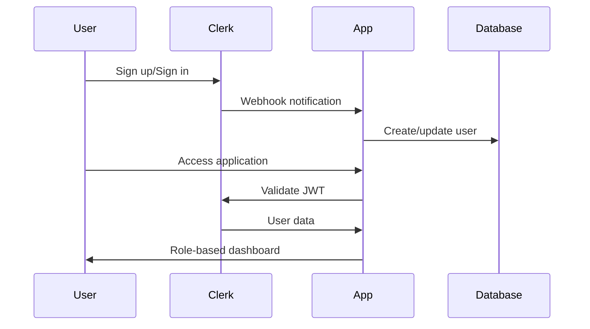

# Feedback Management System - Complete Documentation

This comprehensive documentation covers all aspects of the enterprise-grade feedback management system built for educational institutions.

## Executive Summary

This feedback management system is a sophisticated Next.js application designed to handle student feedback efficiently through a structured workflow. The system supports multiple educational programs (NIAT, Intensive, Academy) with role-based access control, dynamic form generation, and comprehensive analytics.

### Key Technologies

- **Frontend**: Next.js 15, React 19, TypeScript, Tailwind CSS
- **Backend**: Next.js API Routes, MongoDB, Mongoose
- **Authentication**: Clerk with JWT validation
- **UI Components**: Radix UI with custom theming

---

## Application Architecture Overview

### System Design Principles

1. **Role-Based Architecture**: Six distinct user roles with specific permissions
2. **Dynamic Forms**: Database-driven form templates for different programs
3. **Workflow Management**: Kanban-style feedback resolution process
4. **Audit Trail**: Complete activity logging for compliance
5. **Real-time Updates**: Live notifications and status updates
6. **Scalable Design**: Built for enterprise-level usage

### Technology Stack Deep Dive

#### Frontend Technologies

- **Next.js 15**: React framework with App Router
- **React 19**: Latest React features with concurrent rendering
- **TypeScript**: Full type safety across the application
- **Tailwind CSS**: Utility-first styling framework
- **Radix UI**: Accessible component primitives
- **React Hook Form**: Performant form handling
- **Lucide Icons**: Consistent iconography

#### Backend Infrastructure

- **Next.js API Routes**: Server-side API endpoints
- **MongoDB**: NoSQL database for flexible data storage
- **Mongoose**: ODM for MongoDB with schema validation
- **Clerk**: Authentication and user management
- **Svix**: Webhook verification and processing

---

## Authentication & User Management

### Clerk Integration

The application uses Clerk as the primary authentication provider, offering:

- **Multi-provider OAuth**: Google, GitHub, email/password
- **JWT Token Management**: Secure session handling
- **Webhook Integration**: Real-time user synchronization
- **Role Management**: Custom role assignment post-registration

### Authentication Flow



### Security Implementation

1. **Middleware Protection**: All routes except sign-in/sign-up are protected
2. **Role Validation**: Server-side role checking on sensitive operations
3. **JWT Verification**: Token validation on every API request
4. **Webhook Security**: Svix signature verification for Clerk events

---

## User Roles & Permissions

### Role Hierarchy

#### 1. Student

**Primary Function**: Submit and track feedback

**Capabilities**:

- Submit feedback through dynamic forms
- View personal feedback history
- Track status updates and resolutions
- Search and filter own submissions

**Dashboard Features**:

- Program-specific submission forms
- Feedback tracking with status badges
- File upload (screenshots/videos)
- Search and filter functionality

#### 2. Auditor

**Primary Function**: Review and assign feedback

**Capabilities**:

- View all submitted feedback
- Assign feedback to teams with priority
- Set SLA deadlines and KPI categories
- Generate AI-powered resolution suggestions
- Bulk assignment operations

**Dashboard Features**:

- Unassigned feedback queue
- Assignment interface with team selection
- Priority and SLA management
- System-wide metrics

#### 3. Team Member

**Primary Function**: Resolve assigned feedback

**Capabilities**:

- View team-assigned feedback
- Update status (pending → in_progress → resolved)
- Document resolution and preventive measures
- Add comments and progress notes

**Dashboard Features**:

- Kanban board workflow
- Resolution documentation forms
- Team metrics and performance tracking

#### 4. Team Lead

**Primary Function**: Manage team workflow

**Capabilities**:

- All team member permissions
- Assign feedback to specific members
- Approve/reject resolution submissions
- Provide guidance and feedback
- Manage team workload distribution

**Dashboard Features**:

- Enhanced Kanban with assignment controls
- Resolution approval interface
- Team performance analytics
- Member workload management

#### 5. Admin

**Primary Function**: System administration

**Capabilities**:

- Complete user management
- Form template creation and editing
- System-wide analytics and reporting
- Broadcast notifications
- Audit trail access
- Team structure management

**Dashboard Features**:

- User management interface
- Form builder tool
- Comprehensive analytics
- System configuration panel

#### 6. Co-Admin

**Primary Function**: Administrative support

**Capabilities**: Same as Admin (with potential restrictions on critical operations)

### Permission Matrix

| Operation          | Student | Auditor | Team Member | Team Lead | Admin | Co-Admin |
| ------------------ | ------- | ------- | ----------- | --------- | ----- | -------- |
| Submit Feedback    | ✅      | ❌      | ❌          | ❌        | ❌    | ❌       |
| View All Feedback  | ❌      | ✅      | Team Only   | Team Only | ✅    | ✅       |
| Assign to Teams    | ❌      | ✅      | ❌          | ❌        | ✅    | ✅       |
| Assign to Members  | ❌      | ❌      | ❌          | ✅        | ✅    | ✅       |
| Update Status      | ❌      | ❌      | ✅          | ✅        | ✅    | ✅       |
| Approve Resolution | ❌      | ❌      | ❌          | ✅        | ✅    | ✅       |
| User Management    | ❌      | ❌      | ❌          | ❌        | ✅    | ✅       |
| Form Management    | ❌      | ❌      | ❌          | ❌        | ✅    | ✅       |
| System Analytics   | ❌      | Limited | Team Only   | Team Only | ✅    | ✅       |

---

## API Architecture

### Authentication Pattern

All API endpoints follow a consistent authentication pattern:

```typescript
export async function GET/POST/PUT/DELETE(request: NextRequest) {
  try {
    const { userId } = await auth();

    if (!userId) {
      return NextResponse.json({ error: "Unauthorized" }, { status: 401 });
    }

    const user = await DatabaseService.getUserByClerkId(userId);

    // Role-based validation
    if (user.role !== requiredRole) {
      return NextResponse.json({ error: "Forbidden" }, { status: 403 });
    }

    // API logic here

  } catch (error) {
    return NextResponse.json({ error: "Internal server error" }, { status: 500 });
  }
}
```

### Core API Endpoints

#### User Management

- `GET /api/users/profile` - Get current user profile
- `PUT /api/users/profile` - Update user profile
- `POST /api/webhooks/clerk` - Handle Clerk user events

#### Feedback Operations

- `POST /api/feedback` - Submit new feedback (Students)
- `GET /api/feedback` - Get feedback (role-filtered)
- `PUT /api/feedback/update-status` - Update feedback status
- `POST /api/feedback/assign` - Assign to teams (Auditors)
- `POST /api/feedback/assign-member` - Assign to members (Team Leads)
- `POST /api/feedback/approve-resolution` - Approve resolution (Team Leads)

#### Administrative

- `GET /api/admin/users` - User management (Admins)
- `GET /api/admin/audit-logs` - System audit trail (Admins)
- `POST /api/admin/notifications/broadcast` - Send notifications (Admins)

#### Form Templates

- `GET /api/form-templates` - All templates (Admins)
- `GET /api/form-templates/program/{program}` - Program-specific template
- `POST /api/form-templates` - Create template (Admins)

---

## Database Design

### MongoDB Schema Architecture

#### User Model

```typescript
interface User {
  _id?: string;
  clerkId: string; // Primary authentication link
  email: string;
  name: string;
  role:
    | "student"
    | "auditor"
    | "team_lead"
    | "team_member"
    | "admin"
    | "co_admin";

  // Student-specific fields
  program?: "NIAT" | "Intensive" | "Academy";
  admissionYear?: number;
  university?: string;
  studentId?: string;
  contactNumber?: string;

  // Organizational structure
  teamId?: ObjectId; // Reference to Team
  podId?: ObjectId; // Reference to Pod

  createdAt: Date;
  updatedAt: Date;
}
```

#### Feedback Model

```typescript
interface Feedback {
  _id?: string;
  ticketId: string; // Auto-generated unique ID
  studentId: string; // Clerk user ID
  program: "NIAT" | "Intensive" | "Academy";

  // Core feedback data
  course: string;
  unit: string;
  topic: string;
  issueDescription: string;

  // Workflow tracking
  status:
    | "submitted"
    | "assigned"
    | "pending"
    | "in_progress"
    | "resolved"
    | "completed";
  priority: "low" | "medium" | "high" | "critical";

  // Assignment tracking
  assignedTeamId?: ObjectId;
  assignedMemberId?: ObjectId;
  auditorId?: ObjectId;

  // Resolution data
  resolutionText?: string;
  preventiveMeasures?: string;
  leadApprovalStatus?: "pending" | "approved" | "rejected";

  // SLA management
  slaHours?: number;
  slaDeadline?: Date;
  targetResolutionDate?: Date;

  // File attachments
  screenshots: string[];
  video?: string;

  // Timestamps
  submittedAt: Date;
  assignedAt?: Date;
  resolvedAt?: Date;
  completedAt?: Date;
}
```

#### Form Template Model

```typescript
interface FormTemplate {
  _id?: string;
  programType: string; // NIAT, Intensive, Academy
  name: string;
  description: string;
  fields: FormField[]; // Dynamic field definitions
  isActive: boolean;
  version: number;
  createdBy: string;
  createdAt: Date;
  updatedAt: Date;
}

interface FormField {
  name: string;
  label: string;
  type: "text" | "email" | "number" | "select" | "textarea" | "file" | "date";
  required: boolean;
  options?: string[]; // For select fields
  validation?: {
    min?: number;
    max?: number;
    pattern?: string;
  };
  order: number; // Display order
}
```

---

## Application Workflow

### Student Feedback Submission Flow

1. **Authentication**: Student logs in via Clerk
2. **Profile Check**: System verifies role and program enrollment
3. **Form Loading**: Dynamic form template loaded based on program
4. **Form Completion**: Student fills out program-specific fields
5. **File Upload**: Optional screenshots and video upload
6. **Submission**: Data validated and submitted to API
7. **Ticket Generation**: Unique ticket ID created
8. **Notifications**: Auditors notified of new submission
9. **Confirmation**: Student receives ticket ID and tracking info

### Feedback Resolution Workflow

1. **Auditor Review**: Unassigned feedback appears in auditor queue
2. **Assignment**: Auditor assigns to appropriate team with priority/SLA
3. **Team Notification**: Team members notified of assignment
4. **Team Lead Assignment**: Lead assigns to specific team member
5. **Resolution Work**: Member investigates and develops solution
6. **Status Updates**: Progress tracked through status changes
7. **Resolution Submission**: Member submits solution for approval
8. **Lead Review**: Team lead reviews and approves/rejects resolution
9. **Completion**: Approved resolutions marked as completed
10. **Student Notification**: Student notified of resolution

### Status Progression

```
submitted → assigned → pending → in_progress → resolved → completed
                                      ↓
                                  no_issue_found
```

---

## Component Architecture

### Dashboard Components

#### Student Dashboard (`app/dashboard/student/page.tsx`)

- **DynamicFeedbackForm**: Renders program-specific forms
- **FeedbackSuccess**: Post-submission confirmation
- **Feedback History**: Searchable list with status tracking

#### Team Member Dashboard (`app/dashboard/team-member/page.tsx`)

- **KanbanBoard**: Visual workflow management
- **Status Update Modals**: Progress tracking interfaces
- **Resolution Forms**: Solution documentation

#### Admin Dashboard (`app/dashboard/admin/page.tsx`)

- **UserManagementTable**: Complete user administration
- **AuditTrail**: System activity monitoring
- **BroadcastNotifications**: System-wide messaging
- **Form Builder Integration**: Template management

### Shared Components

#### KanbanBoard Component

```typescript
interface KanbanBoardProps {
  feedback: Feedback[];
  onAssignMember?: (feedback: Feedback) => void;
  onUpdateStatus?: (feedback: Feedback) => void;
  onApproveResolution?: (feedback: Feedback) => void;
  userRole: string;
}
```

Features:

- Five-column layout (Assigned, Pending, In Progress, Resolved, No Issue)
- Role-based action buttons
- Priority color coding
- SLA deadline tracking
- Overdue highlighting

#### DynamicFeedbackForm Component

```typescript
interface DynamicFeedbackFormProps {
  program: string;
  onSubmitSuccess: (ticketId: string) => void;
}
```

Features:

- Database-driven form generation
- Field type rendering (text, select, file, etc.)
- Real-time validation
- File upload handling
- Program-specific field sets

---

## Custom Hooks & Utilities

### useToast Hook

```typescript
const { toast } = useToast();

toast({
  title: "Success",
  description: "Operation completed successfully",
  variant: "default" | "destructive",
});
```

Features:

- Global notification system
- Auto-dismiss functionality
- Variant support (success, error, warning)
- Queue management

### Database Service Utility

```typescript
class DatabaseService {
  static async createFeedback(data): Promise<Feedback>;
  static async getUserByClerkId(clerkId): Promise<User>;
  static async updateFeedback(ticketId, updates): Promise<boolean>;
  static async getAllFeedback(): Promise<Feedback[]>;
  // ... additional methods
}
```

Features:

- Centralized database operations
- Error handling and logging
- Connection management
- Query optimization

---

## Security Implementation

### Authentication Security

- **JWT Validation**: Every API request validates Clerk JWT tokens
- **Role-Based Access**: Server-side role checking for all operations
- **Session Management**: Secure session handling with automatic refresh
- **Webhook Verification**: Svix signature validation for Clerk webhooks

### Data Protection

- **Input Validation**: Comprehensive request body validation
- **SQL Injection Prevention**: Mongoose parameterized queries
- **XSS Protection**: React's built-in JSX escaping
- **File Upload Security**: Type and size validation

### API Security

- **Rate Limiting**: Protection against API abuse (recommended)
- **CORS Configuration**: Proper cross-origin request handling
- **Error Handling**: Sanitized error responses
- **Audit Logging**: Complete activity tracking

---

## Best Practices Implemented

### Code Organization

- **Feature-based structure**: Components grouped by functionality
- **Consistent naming**: PascalCase for components, camelCase for functions
- **Type safety**: Comprehensive TypeScript interfaces
- **Barrel exports**: Centralized exports from directories

### Performance Optimization

- **Connection pooling**: MongoDB connection reuse
- **Query optimization**: Efficient database queries
- **Component lazy loading**: Dynamic imports for large components
- **Image optimization**: Next.js built-in optimization

### User Experience

- **Loading states**: Clear progress indicators
- **Error handling**: User-friendly error messages
- **Responsive design**: Mobile-first approach
- **Accessibility**: ARIA labels and keyboard navigation

### Development Workflow

- **TypeScript strict mode**: Enhanced type checking
- **Code formatting**: Consistent code style
- **Error boundaries**: Graceful error handling
- **Documentation**: Comprehensive code comments

---

## Potential Improvements & Roadmap

### Short-term Enhancements

1. **Real-time Features**

   - WebSocket integration for live updates
   - Real-time notifications
   - Live collaboration on feedback resolution

2. **Mobile Optimization**

   - Progressive Web App (PWA) features
   - Mobile-specific UI optimizations
   - Offline capability

3. **Performance Improvements**
   - Redis caching layer
   - Database query optimization
   - Image compression and CDN integration

### Medium-term Goals

1. **Advanced Analytics**

   - Machine learning for auto-assignment
   - Predictive SLA compliance
   - Sentiment analysis of feedback

2. **Integration Capabilities**

   - LMS integration
   - Email notification system
   - Calendar integration for deadlines

3. **Workflow Enhancements**
   - Multi-level approval workflows
   - Automated escalation procedures
   - Custom workflow templates

### Long-term Vision

1. **AI Integration**

   - Automated response suggestions
   - Intelligent categorization
   - Predictive analytics

2. **Enterprise Features**

   - Multi-tenant architecture
   - Advanced reporting suite
   - Compliance management tools

3. **Scalability Improvements**
   - Microservices architecture
   - Kubernetes deployment
   - Global CDN distribution

---

## Deployment & Environment Configuration

### Environment Variables

```bash
# Authentication
NEXT_PUBLIC_CLERK_PUBLISHABLE_KEY=pk_test_...
CLERK_SECRET_KEY=sk_test_...

# Database
MONGODB_URI=mongodb://localhost:27017/feedback_management

# Optional: File Storage
UPLOADTHING_SECRET=...
UPLOADTHING_APP_ID=...
```

### Deployment Checklist

1. ✅ Environment variables configured
2. ✅ Database connection established
3. ✅ Clerk webhooks configured
4. ✅ SSL certificates installed
5. ✅ Monitoring and logging setup
6. ✅ Backup procedures established

### Production Considerations

- **Database Scaling**: MongoDB Atlas or similar managed service
- **File Storage**: AWS S3 or similar cloud storage
- **CDN**: CloudFront or similar for global content delivery
- **Monitoring**: Application performance monitoring tools
- **Backup**: Automated database backups
- **Security**: SSL/TLS encryption, security headers

---

## Conclusion

This feedback management system represents a comprehensive, production-ready solution for educational institutions. Built with modern technologies and following industry best practices, it provides:

### Key Strengths

- **Scalable Architecture**: Built to handle enterprise-level usage
- **Security-First Design**: Multiple layers of security protection
- **User Experience Focus**: Intuitive, role-based interfaces
- **Comprehensive Auditing**: Complete activity logging for compliance
- **Flexibility**: Dynamic forms and configurable workflows
- **Performance**: Optimized for speed and reliability

### Technical Excellence

- **Type Safety**: Full TypeScript implementation
- **Modern React**: Latest React patterns and hooks
- **API Design**: RESTful APIs with proper error handling
- **Database Design**: Well-structured schemas with relationships
- **Security**: Comprehensive authentication and authorization

The system is production-ready with clear paths for enhancement and scaling. The suggested improvements provide a roadmap for continued development based on user feedback and organizational growth.

This documentation serves as a complete guide for developers, administrators, and stakeholders working with the feedback management system.
